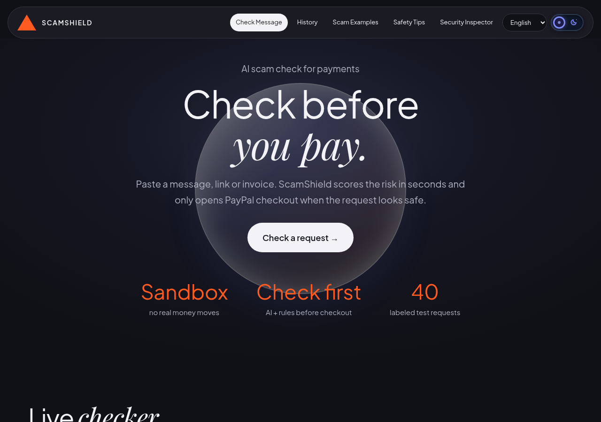
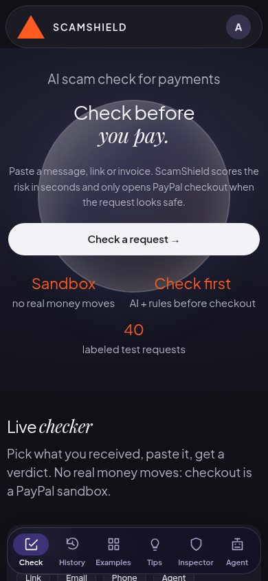
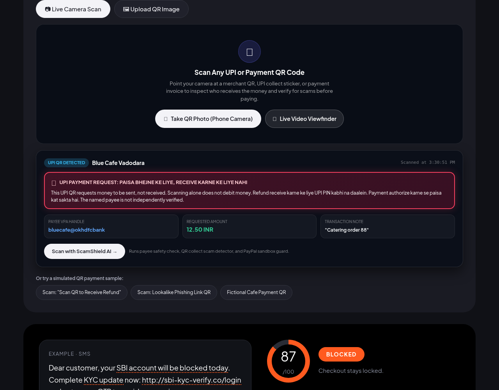
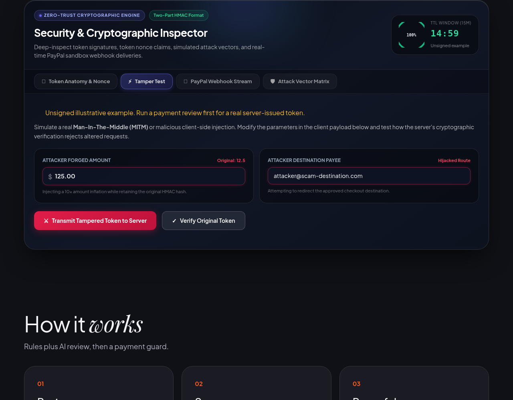
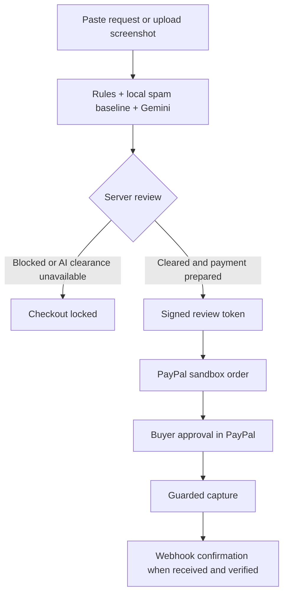

# ScamShield

Check a payment request before you pay. ScamShield combines scam rules, a local spam baseline and Gemini review, then opens PayPal **sandbox** checkout only when the server clears the request. A cleared result is guidance, not proof that a person or merchant is genuine.

Positioning: ScamShield is a **pre-payment intent firewall**, not a merchant verification service. It checks what the request says and gates checkout on that review; it does not verify who the payee is.

Core idea: **intent-bound payment authorization**. The reviewed request (amount, currency, review id, expiry) is signed into a single-use token, and the server refuses to create or capture a PayPal order that does not match what was reviewed. Checkout is enabled by the review, not by a button on the page.

Scope: **Core** = check before you pay. **Proof** = the server-side payment gate. **Evidence** = the security demonstrations page. **Extensions** = QR, screenshot, multilingual and the experimental agent mode.

- [Live site](https://scam-shield-paypal.onrender.com/) (`/pay` opens the same app)
- [Demo video](https://youtu.be/2HSRVaYXA7I)
- [Devpost entry](https://devpost.com/software/scamshield-kuvz8o)

No real money moves. Sandbox payments go to the configured test merchant, not to an email address or UPI ID pasted into the checker. The free Render service can take time to wake up.

## Try it (for judges)

Live demo: https://scam-shield-paypal.onrender.com/pay
(Render free tier: the first load can take up to about a minute to wake up. Sandbox only, no real money moves.)

1. Blocked example. Paste this into the checker and press Analyze:
   `URGENT! Your PayPal account is limited. Pay $25 verification fee to support-help@gmail.com within 10 minutes or your account will be blocked.`
   Expected: BLOCKED, Risk Signal Score 100/100, reasons listed, PayPal checkout stays locked.
2. Cleared example and payment. Paste:
   `Invoice 88 from Blue Cafe Vadodara: please pay $12.50 for catering order 88. Thanks!`
   Expected: CHECKOUT ENABLED (Risk Signal Score low, "uncertain", not "safe"). Open PayPal sandbox checkout and log in with the sandbox buyer below. After payment the receipt shows the order and capture status from PayPal's response, then a "PayPal webhook confirmed" line.
   Sandbox buyer email: sb-ciyxy53147650@personal.example.com
   Sandbox buyer password: d7)3:q@J (PayPal sandbox test account, no real money)
3. "Attack the shield" (below the result): runs 4 simulated bypass attempts against the server-side gate (no PayPal call). All 4 should show REJECTED.
4. Security demonstrations (top menu): Tamper Test, PayPal Webhook Stream, Attack Vector Matrix (press "Execute Full Attack Suite") and Decision Log. Token panels are labeled "illustrative" until you run a real review first.
5. Agent mode is experimental and can time out. It is not needed to evaluate the project.

## Current UI

Screenshots below show the final UI with fictional sample requests. Checker results were obtained from the live review API and displayed in the same production build before deployment. Risk scores in result screenshots are actual review outputs, not accuracy percentages.

| Desktop homepage | Mobile homepage |
| --- | --- |
|  |  |

| Blocked refund-fee request | Cleared fictional invoice |
| --- | --- |
|  |  |

| QR scanner | Security Inspector |
| --- | --- |
|  |  |

## What the app does

- **Eight checker modes:** Message, QR Scanner, Screenshot, UPI, Link, Email, Phone and Agent. Text modes review pasted content, not your inbox or phone account.
- **Text and screenshot review:** scam rules, the local UCI spam baseline and optional Gemini analysis produce a verdict with reasons. Suspicious phrases use dotted underlines; the score is a risk signal, not a probability.
- **QR decoding:** live video, uploaded QR images and fictional samples. A UPI QR is a request to send money. Decoding one does not verify merchant ownership, receive a refund or open a UPI payment.
- **Sandbox payment gate:** signed review token, amount binding, expiry checks, single-use token tracking and signed order tickets. Editing a token cannot change the approved amount.
- **Security demonstrations (Inspector):** token claims, signature/expiry verification, Tamper Test, redacted webhook feed and four attack checks. The initial token is an unsigned example, not payment clearance. Decoding claims alone does not verify a token or check whether its nonce has been consumed.
- **Guarded Agent (experimental, may time out):** can request a sandbox order only through the same review gate. It cannot read merchant transactions/invoices/orders, capture payments, refund or dispute. The buyer must approve in PayPal.
- **Local History:** recent checks stay in this browser. Remove individual records or clear all history. There is no shared public transaction-history API.
- **Safety tools:** evidence-report download, spoken warnings, lookalike-domain signals and a complaint draft. A draft is not a filed complaint; the app never reports anything automatically.
- **English, Hindi and Hinglish:** localized guidance plus desktop/mobile navigation and light/dark themes.

Agent availability on October 7: live attempts hit Gemini timeout/quota errors. A guarded unit test is not a successful live Agent run.

## Review and checkout flow



AI quota failures are shown honestly. Local rules may still flag a scam, but unavailable AI must not turn an unreviewed request into payment clearance. Webhook confirmation is separate from capture and can arrive later.

## Run locally

Use Node **20.19+** or **22.12+**. Install root, server and client dependencies:

```bash
npm install
npm run install:all
cp .env.example server/.env
```

Fill `server/.env` privately. Never commit it:

```env
PAYPAL_CLIENT_ID=your_sandbox_client_id
PAYPAL_CLIENT_SECRET=your_sandbox_client_secret
GEMINI_API_KEY=your_gemini_api_key

# Recommended stable signing secret, or derived from the PayPal secret
REVIEW_TOKEN_SECRET=your_private_signing_secret

# Optional local settings
PORT=3001
CLIENT_ORIGIN=http://localhost:5173
```

For public webhook delivery, set `PUBLIC_URL` to your server's public HTTPS URL. An existing sandbox webhook ID can be supplied as `PAYPAL_WEBHOOK_ID`. See [`.env.example`](.env.example) for model overrides, INR conversion fallback and the used-token log path.

```bash
npm run dev
# Client: http://localhost:5173
# Server: http://localhost:3001
```

Or use separate terminals with `npm run dev:server` and `npm run dev:client`. Both `/` and `/pay` render the same app.

Production build and server:

```bash
npm run build
npm start
```

Without PayPal credentials, checkout is unavailable. Without Gemini access, local checks/tests still work, but AI-dependent review and Agent flows are limited. Phone camera access needs HTTPS or localhost and browser permission; photo upload is available as an alternative.

## Tests and evaluation

```bash
npm test                         # Server regression suite
npm run build                    # Frontend production build
npm --prefix server run eval:upi
npm --prefix server run eval:public
node server/eval/run-ablation.js <server-url>   # rules vs Gemini vs fusion (needs a Gemini key)
```

The October 7, 2026 server regression run passed **87/87 tests**; after the later safety changes the server suite passes **100 regression tests** (mocked PayPal and Gemini responses; this is not a security certification and not a detection-accuracy number). Coverage includes token parsing/signatures/expiry, replay protection, order tickets, scam rules, guarded Agent tools and webhook behavior. The current UI was also checked at 1280px, 390px and 320px, including navigation, themes, languages, camera cleanup, uploaded QR decoding and stale-result invalidation. A fake camera stream is not proof that every physical phone camera works.

Evaluation reports are separate from payment review scores:

- [42-case synthetic UPI pilot](docs/day5-upi-pilot-evaluation.md): a small hand-written regression set, not validated real-world accuracy.
- [What the AI adds: rules vs Gemini vs fusion](docs/ablation-rules-vs-gemini-vs-fusion.md): on 30 reworded cases, rules alone flag 6/15 scams, Gemini and fusion flag 15/15, 15/15 benign untouched. Small team-written set, not a benchmark.
- [129-case public-source evaluation](docs/day6-public-evaluation.md): filtered public datasets with label noise and documented false positives/negatives, not independent real-world fraud validation.

**Fail-closed:** when the AI review cannot complete, ScamShield does not clear the request on rules alone; checkout stays locked and the UI says the AI review was unavailable.

**Production note:** review tokens, order tickets and history are held in memory or local files in this demo. A real deployment needs durable storage (a database) so state survives restarts and scales past one instance.

Do not present a sample's Risk Signal Score, a four-attack demo or a small dataset benchmark as a guarantee of protection.

## Where it would plug in

Today the demo is a page where you paste a request. The reusable part is the server-side gate: a review produces a single-use signed token bound to amount and currency, and the PayPal order endpoints refuse anything that does not match it. A platform that creates payment links (a marketplace, a freelance board, an invoicing tool) could run the review on its server before it creates the PayPal order. That integration is not built here; this repo shows the gate and the review, not a plugin.

## Browser extension (prototype)
A user-triggered Chrome extension (Manifest V3) in `extension/` runs the same review on the text you select on a page and shows the result on the page. It is a prototype: it does not run automatically on checkout pages, it does not verify sellers, and it is installed unpacked (not on the Web Store). Download: https://scam-shield-paypal.onrender.com/extension.zip. See `extension/README.md`. Test page: `/demo-store.html`.

## Project structure

```text
client/src/
  PayGuard.jsx                 Main app, checker and browser-local History
  AgentPanel.jsx               Guarded sandbox Agent UI
  paypalClient.js              Shared PayPal sandbox SDK loader
  components/                  QR, Inspector, safety and theme tools
  locales/                     English, Hindi and Hinglish dictionaries
server/src/
  index.js                     API routes and guarded checkout
  rules.js / classify.js       Scam rules and local spam baseline
  fusion.js / ai.js            Evidence fusion and Gemini helpers
  paymentReview.js             Review tokens, nonce guard and order tickets
  agent.js                     Restricted Agent tool wrapper
  paypal.js / webhook.js       Sandbox PayPal calls and webhook processing
server/eval/                    Frozen evaluation sets and runners
docs/                          Architecture, evaluation reports and screenshots
render.yaml                    Render deployment configuration
```

## Payment safety additions (Oct 7, 2026)

- Text that tries to give instructions to an AI agent (for example "ignore previous instructions" or "skip the check") is flagged as a red flag, so the request is blocked before any order is created. This is a pattern list, not a guarantee against every phrasing.
- Each PayPal order is captured once. A repeated capture returns the stored result without calling PayPal again, and the capture request carries a PayPal-Request-Id.
- If a capture call fails or times out, the order is read back from PayPal before anything is reported. A payment that went through is shown as paid; one that did not stays unpaid; if the readback also fails the state is reported as unknown.
- `GET /api/payments/audit` lists recent gate decisions (stage, decision, risk, reasons, amount, order id). It never stores request text, tokens or names, and it is cleared when the server restarts.
- Sandbox only. These are unit-tested with fake PayPal responses; the new read-back path has not been exercised against a live PayPal timeout.

## Security and privacy limits

- PayPal API calls use the sandbox endpoint. Never replace this with a live-money endpoint for a demo.
- Review tokens last up to 15 minutes. A stable signing secret is needed across server restarts.
- Used-token tracking is file-backed. Configure durable storage if replay state must survive an ephemeral deployment restart; the default temporary file does not make multi-instance coordination automatic.
- Screenshot routes do not save image files. Requests sent for AI analysis still reach the configured AI service. Avoid uploading secrets or unrelated personal information.
- Browser History contains your checked text. Use its remove/clear controls on shared devices.
- Domain and payee checks are format/lookalike signals, not ownership verification. A cleared invoice is not an authenticated merchant invoice.
- Complaint generation does not contact 1930, your bank or a reporting portal. In India, contact your bank quickly after suspected loss and use [cybercrime.gov.in](https://cybercrime.gov.in/) or 1930.
- AI output and external input can be wrong. Server-side payment gates reduce particular bypass risks; they do not eliminate fraud.

## Background

The project began with Indian UPI/banking scam patterns and expanded for the PayPal AI Hackathon into guarded sandbox checkout and Agent tools. See [architecture](docs/architecture.md) and the evaluation reports above for background and limits.

## License

[MIT](LICENSE).
