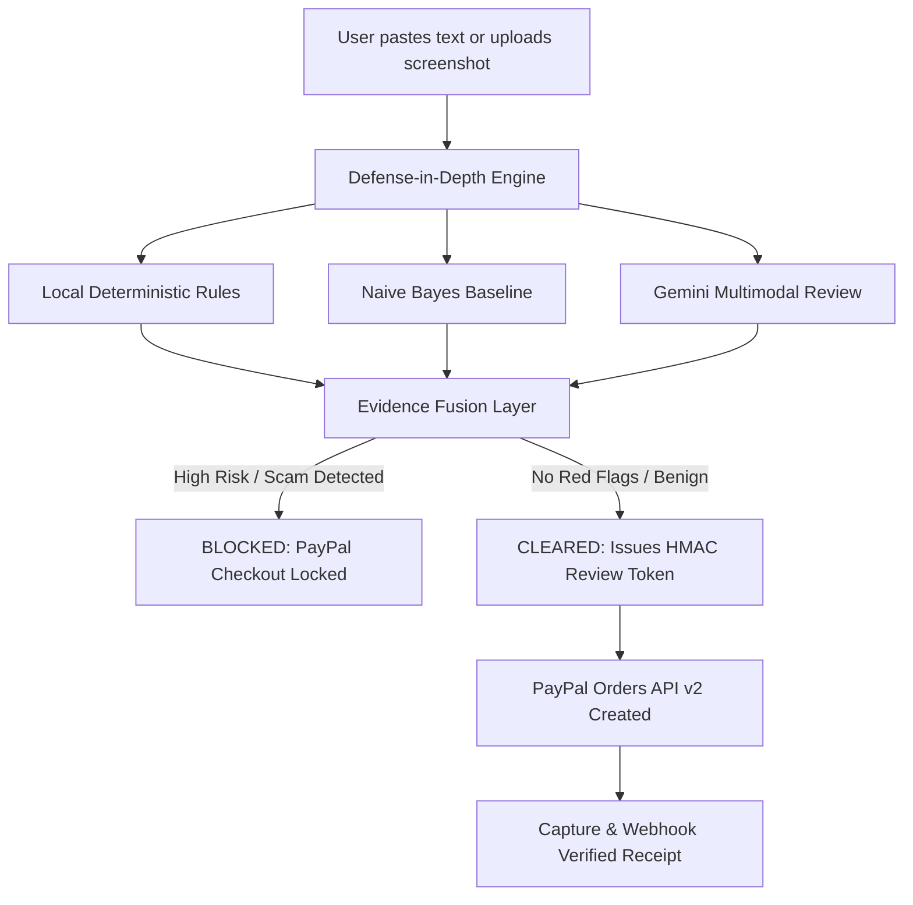

# ScamShield: AI-Powered Payment Fraud Prevention & Guarded PayPal Checkout

ScamShield intercepts payment requests and suspicious communications with multi-layered AI & rule-based inspection **before** you pay. Only a payment request that safely passes all automated checks unlocks a guarded PayPal Sandbox checkout. A flagged request is blocked on the server, ensuring fraudulent PayPal orders are never created.

Built for the [PayPal AI Hackathon](https://paypalaihackathon.devpost.com/).  
- **Live Demo**: [https://scam-shield-paypal.onrender.com/pay](https://scam-shield-paypal.onrender.com/pay) *(Render free tier, initial cold boot may take up to a minute)*  
- **Demo Video (2m 24s)**: [https://youtu.be/piMQvRnr5xI](https://youtu.be/piMQvRnr5xI)  
- **Devpost Entry**: [https://devpost.com/software/scamshield-kuvz8o](https://devpost.com/software/scamshield-kuvz8o)

---

<table>
  <tr>
    <td align="center"><br><sub><b>Blocked</b>: PayPal never opens</sub></td>
    <td align="center"><br><sub><b>Cleared</b>: Sandbox checkout unlocks</sub></td>
    <td align="center"><br><sub><b>Mobile View</b></sub></td>
  </tr>
</table>

---

## Key Features

- **3-Layer Defense-in-Depth Fusion Engine**:
  1. **Deterministic Local Rules**: Instant detection of high-risk patterns (OTP/UPI PIN theft, advance fees, impersonation, phishing domains).
  2. **UCI Machine Learning Spam Baseline**: Secondary statistical spam scoring for text messages.
  3. **Google Gemini Semantic Review**: Multimodal analysis (text + screenshot images) identifying psychological pressure, subtle fraud phrasing, and missing invoice metadata.
- **India & South Asia Localization**:
  - Trilingual support (**English, Hindi, and Hinglish** colloquialisms like *"bta do"*, *"bhej do"*, *"account block hoga"*).
  - PII and sensitive data masking for UPI IDs, URLs, and phone numbers.
  - Actionable recovery guidance including India's official National Cyber Crime Helpline (**1930**).
- **Guarded PayPal Sandbox Gate**:
  - Cryptographically HMAC-signed, short-lived (15-minute) review tokens.
  - Strict server-side single-use nonce tracking (`used.log`) preventing double-spend and parallel replay attacks.
  - Orders API v2 enforcement: sandbox orders are strictly capped to the verified amount from the review token.
- **Interactive Security Playground ("Attack the Shield")**:
  - Real-time bypass attack simulation testing 4 vector attacks: amount tampering, expired tokens, token reuse, and fabricated payment IDs.
- **Bilingual Evidence Reports**: Downloadable audit trails with categorized risk signals and safety recommendations.

---

## How It Works



1. **Submit Request**: Paste an invoice, chat message, or upload a payment screenshot.
2. **Multi-Model Analysis**: Gemini extracts payee, amount, urgency, and anomalies while local rules screen for known scam signatures. Strictest verdict applies.
3. **Verdict**:
   - **BLOCKED**: Server refuses to sign a payment token; checkout cannot open.
   - **CLEARED**: Server signs a short-lived review token with the exact audited amount.
4. **Guarded Checkout**: PayPal sandbox button initiates payment locked strictly to the token's parameters.
5. **Verification & Audit**: Webhook signature is validated and confirmation receipt is generated.

---

## Project Structure

```text
├── client/                     # Frontend application (React 18, Vite 6, Tailwind CSS)
│   ├── src/
│   │   ├── PayGuard.jsx        # Main guarded payment checkout experience
│   │   ├── App.jsx             # Scam detection chat and UI shell
│   │   └── ...
├── server/                     # Backend API (Express.js, Node.js >= 20)
│   ├── src/
│   │   ├── ai.js               # Google Gemini SDK integration & prompt guardrails
│   │   ├── rules.js            # Deterministic Indian & global scam rule definitions
│   │   ├── classify.js         # Local Naive Bayes spam classifier
│   │   ├── fusion.js           # Evidence fusion engine combining rules + ML + AI
│   │   ├── paymentReview.js    # Review tokens, HMAC signing & replay attack defense
│   │   ├── paypal.js           # PayPal Orders API v2 client
│   │   └── webhook.js          # Webhook signature verification and event logging
│   └── eval/                   # Evaluation test suites & datasets
├── data/                       # Datasets for evaluation and training
├── docs/                       # Architecture diagrams and benchmark evaluations
├── render.yaml                 # One-click Render production deployment blueprint
└── package.json                # Root workspace configuration with dual-dev scripts
```

---

## Quick Start & Local Setup

### Prerequisites
- **Node.js**: `v20.19+` or `v22.12+` (Node 24 supported)
- **npm**: `v9+`

### 1. Clone the Repository
```bash
git clone https://github.com/gajit9147-dev/scam-shield-paypal.git
cd scam-shield-paypal
```

### 2. Configure Environment Variables
Copy `.env.example` to `server/.env` (and root `.env`):
```bash
cp .env.example server/.env
```

Open `server/.env` and supply your credentials:
```env
# PayPal Sandbox Credentials (from developer.paypal.com)
PAYPAL_CLIENT_ID=your_paypal_sandbox_client_id
PAYPAL_CLIENT_SECRET=your_paypal_sandbox_client_secret

# Google Gemini API Key (from Google AI Studio)
GEMINI_API_KEY=your_gemini_api_key

# Local Server Settings
PORT=3001
CLIENT_ORIGIN=http://localhost:5173

# Optional: Public URL for PayPal Webhook delivery (e.g. ngrok / cloudflare tunnel)
PUBLIC_URL=
```
> **Note**: Without a Gemini API key, local rules and unit tests still run and block scams, but AI-cleared checkout will remain locked for security.

### 3. Install Dependencies
You can install all dependencies across root, server, and client with one command:
```bash
npm run install:all
```
*(Or individually via `npm install` in root, `cd server && npm install`, `cd client && npm install`)*

### 4. Run the Application

#### Option A: Run Both Client & Server Concurrently (Recommended)
From the root directory:
```bash
npm run dev
```

#### Option B: Run in Separate Terminals
- **Terminal 1 (Backend Server)**:
  ```bash
  npm run dev:server
  # Server starts at http://localhost:3001
  ```
- **Terminal 2 (Frontend Client)**:
  ```bash
  npm run dev:client
  # Vite dev server starts at http://localhost:5173
  ```

Open **http://localhost:5173/pay** in your browser to test the payment shield.

---

## Testing & Benchmarks

The project comes with a comprehensive suite of automated unit, integration, and dataset evaluation tests.

### 1. Server Unit & Integration Tests (83/83 Passing)
Tests payment token tamper-proofing, replay prevention, rule accuracy, and prompt injection defense:
```bash
npm --prefix server test
```

### 2. UPI Pilot Synthetic Evaluation Benchmark
Evaluates detection across synthetic Indian payment fraud scenarios:
```bash
npm --prefix server run eval:upi
```
*Current benchmark: **100.00% Precision, 100.00% Recall, 0 False Positives**.*

### 3. Public Indian Scam Dataset Benchmark
Evaluates real-world Indian SMS and payment scams:
```bash
npm --prefix server run eval:public
```
*Current benchmark: **98.55% Precision, 98.55% Recall, 98.45% Accuracy**.*

### 4. Frontend Production Build Check
```bash
npm --prefix client run build
```

---

## Security & Architectural Guarantees

- **Tamper-Proof Tokens**: The review token is HMAC-signed with `REVIEW_TOKEN_SECRET` (or a key derived from the PayPal secret). Any client-side edit to amount, payee, or expiration invalidates the signature immediately.
- **Strict Nonce Tracking**: Single-use token IDs (`jti`) are recorded in an append-only log (`used.log`), preventing race conditions and double-spending across server restarts.
- **Strict Sandbox Boundary**: No real money is transferred; all transactions execute within PayPal's Sandbox developer environment.
- **Untrusted Input Isolation**: All user text and OCR transcripts are treated strictly as untrusted data strings. System instructions cannot be overridden by adversarial prompt injections.

---

## Background & Evolution

ScamShield originated as a research project focused on UPI and digital banking fraud detection in India. The foundational scam heuristics, dialect normalizers, and trilingual evaluation frameworks are documented in:
- [System Architecture](docs/architecture.md)
- [UPI Pilot Evaluation Report](docs/day5-upi-pilot-evaluation.md)
- [Public Dataset Benchmark Report](docs/day6-public-evaluation.md)

For the **PayPal AI Hackathon**, the architecture was expanded to include the multimodal Gemini fusion gate, cryptographic review tokens, PayPal Orders API v2 sandbox enforcement, and the interactive Attack the Shield security playground.

---

## License

This project is licensed under the [MIT License](LICENSE).
