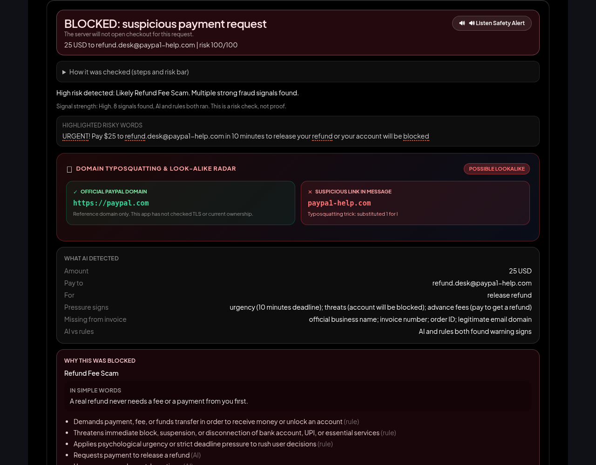
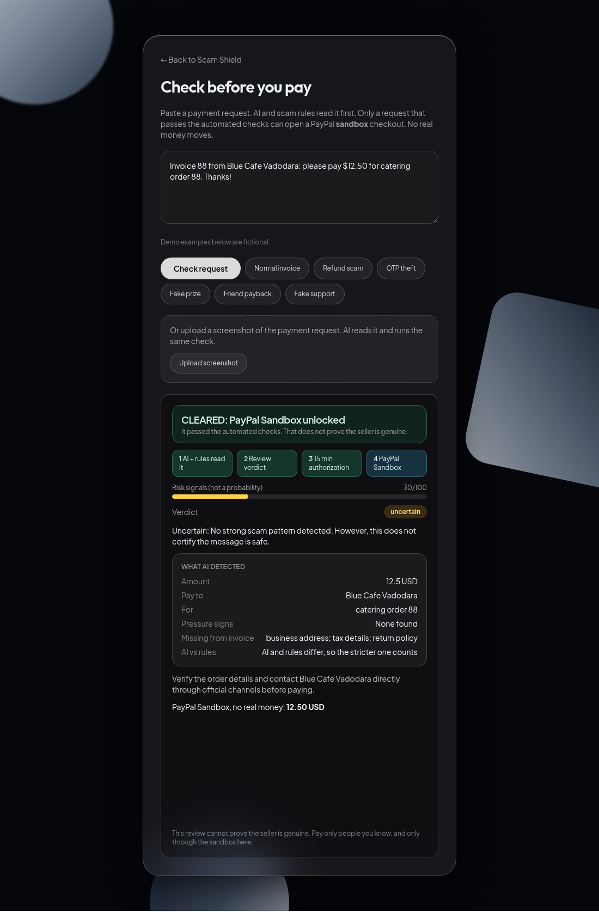
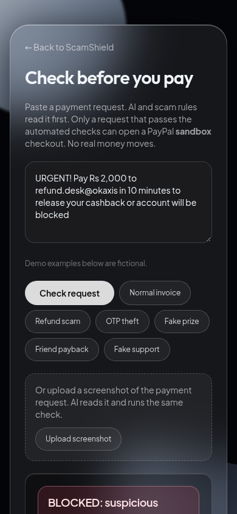

# ScamShield

ScamShield checks a payment request with AI **before** you pay. Only a request that passes the automated checks can open a PayPal sandbox checkout. A flagged request is blocked on the server, so the PayPal order is never created.

Built for the [PayPal AI Hackathon](https://paypalaihackathon.devpost.com/).
Live demo: https://scam-shield-paypal.onrender.com/pay (free server, the first load can take up to a minute).
Demo video (2 min 24 s): https://youtu.be/piMQvRnr5xI
Devpost entry (PayPal AI Hackathon): https://devpost.com/software/scamshield-kuvz8o

<table>
  <tr>
    <td align="center"><br><sub>Blocked, PayPal never opens</sub></td>
    <td align="center"><br><sub>Cleared, sandbox checkout unlocks</sub></td>
    <td align="center"><br><sub>Mobile</sub></td>
  </tr>
</table>

## How it works

1. Paste a payment request (invoice, seller message, "please pay" note) or upload a screenshot of it.
2. Gemini (text and vision) pulls out who is asking, how much, what pressure it sees and what the invoice is missing. Local scam rules read the same text. The stricter result counts.
3. The verdict comes first: **BLOCKED** or **CLEARED**, with the amount and a risk score (0-100, risk signals, not a probability). The steps, the highlighted risky words and the reasons are below it.
4. Blocked: the server will not issue a review token, so PayPal cannot open.
5. Cleared: the server signs a short-lived review token. The PayPal sandbox button (Orders API v2, create and capture) uses that token for the reviewed amount only.
6. After the payment, the server checks that the capture is COMPLETED and that the amount matches, then shows a receipt.

An **Attack the shield** button runs 4 bypass attempts on the server and shows that each one is rejected: an edited amount, an expired token, a reused token and a fake payment id.
There is also a downloadable evidence report for every check.

## What the server enforces

- The review token is HMAC-signed and holds the reviewed amount, currency, payee, purpose, risk level, a random id and an expiry (15 minutes). Any edit breaks the signature.
- A token can be used once. A parallel second use is rejected.
- Capture only works for an order the server created from a valid token, and the captured amount must match.
- PayPal also confirms the capture on its own: the server registers a sandbox webhook (`PAYMENT.CAPTURE.COMPLETED`) at startup and only records an event after PayPal verifies its signature. The receipt shows when that confirmation arrived.
- Screenshots are limited to PNG, JPEG or WebP and 6 MB. The check endpoints are rate limited per route.
- Text and screenshots are sent to the AI as untrusted data. Instructions written inside them are ignored. The AI can only add risk signals. It cannot clear a request that the rules block.

## Honest limits

- A CLEARED result means the request did not match our blocking rules. It does not prove the seller is genuine, and no output proves a payment is safe.
- The sandbox order pays the app's own PayPal sandbox merchant, not the seller named in the request. The payee in the text is read but not verified, and the checkout line says so. It shows the gate, not a real seller payout.
- Webhook confirmations are also kept in memory, and the server needs a public URL to register the webhook (Render sets it automatically).
- Review tokens and expected orders live in server memory. That fits this single-instance sandbox demo. If the free server restarts, the user sees "Review expired or missing. Check the request again before paying". A real product would keep this state in a shared database.
- INR amounts are converted to USD at a fixed demo rate of 85 INR = 1 USD (set with `DEMO_INR_PER_USD`). It is not a live exchange rate. The PayPal sandbox charges in USD, so the screen shows the USD amount and says so.
- If the AI review does not answer, the screen says "NOT CLEARED: AI review unavailable" and checkout stays locked. Rules alone never unlock checkout.
- "Signal strength" is a simple read of the risk score and the number of signals. It is not a calibrated probability.
- The older chat page (`/`) has an optional OCR fallback that loads Tesseract from a CDN. The `/pay` flow does not use it.
- No real money moves. Only the free PayPal sandbox is used.

## Run locally

Install Node.js 20.19+ or 22.12+. Then:

```bash
git clone https://github.com/gajit9147-dev/scam-shield-paypal.git
cd scam-shield-paypal/server && npm ci && npm run dev
```

In a second terminal:

```bash
cd scam-shield-paypal/client && npm ci && npm run dev
```

Open the URL Vite prints (usually http://localhost:5173) and go to `/pay`.

Set keys in `server/.env` (never commit it) or in your host's environment settings:

```
PAYPAL_CLIENT_ID=your-sandbox-client-id
PAYPAL_CLIENT_SECRET=your-sandbox-secret
GEMINI_API_KEY=optional
```

Get sandbox keys at https://developer.paypal.com (Apps and Credentials, Sandbox). Test payments use a sandbox buyer account from the same dashboard. Without a Gemini key the rules still run and block scams, but checkout never unlocks, and the screen says that the AI did not answer.

Checks:

```bash
cd server && npm test      # 61 tests, PayPal calls are mocked
node eval/run-paypal-testset.js http://localhost:3001   # 40 labeled payment requests (20 scams, 20 safe)
cd client && npm run build
```

## Test it

On `/pay`, tap the fictional examples, for instance **Normal invoice** (cleared) and **Fake prize** (blocked). Click **Attack the shield**. Use the sandbox buyer account from the Devpost testing instructions to pay.

## Repo map

- `client/` - React, Vite and Tailwind. `src/PayGuard.jsx` is the payment check page.
- `server/` - Express API. `src/paymentReview.js` (review, token, attack demo), `src/paypal.js` (Orders API), `src/ai.js` (Gemini), `src/rules.js` (scam rules).
- `docs/screenshots/` - screenshots of the live app.
- `render.yaml` - one free Render web service that builds the client and serves it from the server.

## Background

ScamShield started as a UPI scam checker for a university project. The scam rules and the Hindi, Hinglish and English evaluation work from that project are still here: [architecture](docs/architecture.md), [synthetic pilot](docs/day5-upi-pilot-evaluation.md), [public datasets](docs/day6-public-evaluation.md). The PayPal payment gate, the screenshot review, the Attack panel and the verdict-first interface are the work for this hackathon.

## License

MIT
