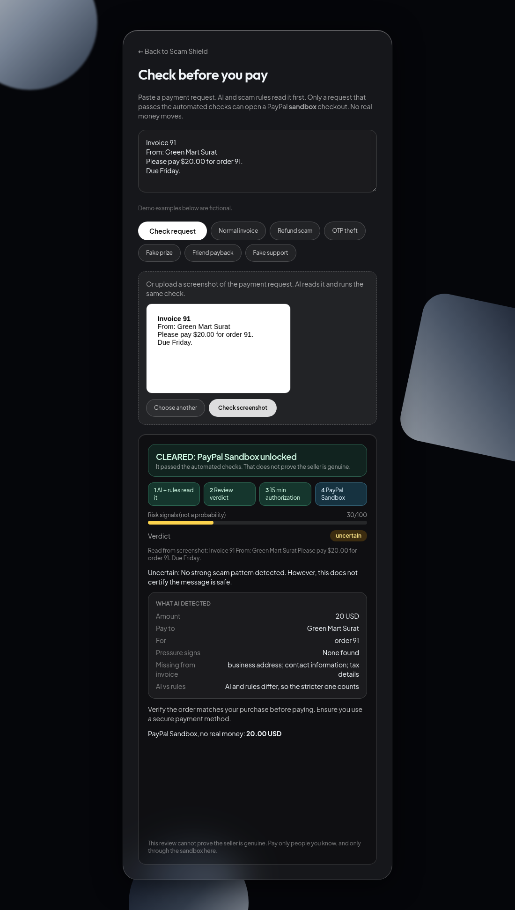

# UPI Scam Shield

A defensive student prototype for merchant-support triage of suspicious UPI/payment messages, built for the Razorpay AI Buildathon. **The prototype uses a measured English general-spam model and cautious payment-warning rules, not a validated UPI scam detector.** No output proves a payment message is safe.

## Run locally

Install Node.js 20.19+ or 22.12+ and npm. Clone this repo and open two terminal windows in its root folder:

```bash
git clone https://github.com/gajit9147-dev/scam-shield-paypal.git
cd scam-shield-paypal
cd server
npm ci
npm run dev
```

In the second terminal, from `scam-shield-paypal`:

```bash
cd client
npm ci
npm run dev
```

Open the URL printed by Vite (usually http://localhost:5173). Paste a **made-up, non-private** payment message and press **Send** - it is checked straight away, no second question needed - or press **+** and pick a screenshot of a message: with a Gemini key the server looks at the image itself (vision) and answers straight away in chat; without a key the app falls back to reading its text on-device (tesseract.js OCR, loaded from a CDN at runtime) into the chat composer so you can correct it before sending. The assistant responds in chat. Follow-up questions about the shared message - **it is froud or not**, **how to prevent this** - get natural, in-context answers through Gemini when a key is set, and canned guidance without one. **I sent money to the wrong person, what do I do?** gives recovery steps. There are no option buttons; ask a follow-up in the same chat without uploading again. Typos in common fraud words are tolerated. Unclear requests get a clarifying reply. The optional Gemini review helps the verdict, while chat intent uses local English/Hindi/Hinglish patterns without a key. Extraction quality depends on the screenshot; Hindi UI is available from the language selector. The frontend calls the local Express API through Vite's `/api` proxy. No API key or database is needed. Stop either process with Ctrl+C.

Quick API test in another terminal:

```bash
curl -X POST http://localhost:3001/api/check -H 'Content-Type: application/json' -d '{"text":"Synthetic payment reminder"}'
```

If `curl` isn't available on Windows, use the browser UI. If the frontend says it cannot reach the API, check that the server terminal still shows `API ready`.

## Local checks

Run these in separate terminals after `npm ci` in each folder:

```bash
cd server && npm test
cd server && npm run eval:upi      # synthetic UPI pilot (hand-written, frozen)
cd server && npm run eval:public   # public downloaded Indian scam datasets
cd client && npm run build
```

The synthetic pilot scores 42 frozen, hand-written Hindi/Hinglish/English cases through the real verdict path: precision 100%, recall 100%, zero false positives - see [Day 5 evaluation](docs/day5-upi-pilot-evaluation.md). The public-source run scores 129 frozen cases sampled from two downloaded, publicly available Indian scam datasets (Hugging Face, keyword-labeled by their authors): precision 98.55%, recall 98.55%, with one kept and documented false positive and one false negative - see [Day 6 public evaluation](docs/day6-public-evaluation.md). **Neither is validated real-world UPI accuracy;** both docs say exactly why.

## Screenshots

| Payment blocked | Cleared to pay | Screenshot review | Mobile (390px) |
| --- | --- | --- | --- |
|  |  |  |  |

For a local UI check, leave the server and Vite running, then try **made-up** messages: `Share OTP 123456 to claim your refund` and `Pay a fee via https://example.invalid to receive your cashback` should show a `scam` warning. `Your payment of INR 300 was completed` should show `uncertain`, not `safe`. Submitting an empty chat message is blocked in the UI; the API separately rejects blank input with HTTP 400. A standalone link without a matching suspicious request may be `uncertain`: the tool does not check whether links are safe. These are synthetic integration cases, not UPI performance measurements.

## Wrong-payment recovery guidance

For a sent message or uploaded screenshot, ask for wrong-payment help in the conversation even if OCR misses debit words: note the 12-digit UPI reference (UTR), raise an "Incorrectly transferred to another account" complaint on the transaction in the UPI app, ask your bank to request a reversal, escalate app > partner bank > your bank > NPCI (npci.org.in), and call 1930 / file at cybercrime.gov.in if the receiver refuses or fraud is involved. The app only explains the process; it never promises recovery.

## Optional AI review (Gemini)

With no key the app runs fully on its own: local payment rules + the UCI baseline. To add AI review (better Hindi/Hinglish understanding and clearer reasons), get a free Gemini key at https://aistudio.google.com/apikey, copy `.env.example` to `server/.env`, and set `GEMINI_API_KEY` (optionally `GEMINI_MODEL`, default `gemini-3.8-flash` with automatic fallbacks). The AI may only return the existing `scam`/`uncertain` labels; a local `scam` warning is never downgraded, and any AI error or timeout silently falls back to the local result. Keys must never be committed: `.gitignore` excludes `.env` files.

## Current response contract

`POST /api/check` accepts `{ "text": "..." }`, with 1-1000 characters; empty/long input returns HTTP 400. It responds with:

```json
{
  "label": "uncertain",
  "reason": "No strong fraud request pattern was found. Text alone cannot establish that a payment message is safe.",
  "confidence": null,
  "evidence": [],
  "safeAction": "Do not act on this verdict. Verify in the official payment or bank app, and ask a person if unsure.",
  "method": "payment warning rules + UCI general-spam baseline",
  "generalSpamSignal": "not flagged",
  "evidenceHi": [],
  "recommendationsHi": [],
  "recoveryFocus": "money_not_sent",
  "maskedEntities": { "urls": [], "upiIds": [], "amounts": [] }
}
```

`evidenceHi` / `recommendationsHi` carry the Hindi copies of the evidence and action bullets.
`recoveryFocus` is `money_sent` when the text looks like a completed payment (the UI highlights the
after-payment recovery path) and `money_not_sent` otherwise. `maskedEntities` lists only masked identifiers
(`sb***.xyz`, `ra***@okaxis`): full links, domains and UPI IDs are never echoed back, and pasted links are
never fetched by the server. The UI also links to the official
[NCRP suspect repository](https://cybercrime.gov.in/Webform/suspect_search_repository.aspx) for a
user-initiated check of a number, UPI ID or link - "not listed" never means safe.

Labels are `scam` (suspicious request pattern) and `uncertain` (including apparently ordinary messages). `safe` is deliberately not emitted. Confidence is null until a real UPI evaluation can justify it. The UCI ham/spam score is only a separate general-spam signal, never a payment-safety score. The API never echoes the pasted text or logs it by default.

## Repo map

- `client/` - React + Vite + Tailwind conversational interface with screenshot image checks (OCR fallback), verdict replies and recovery guidance
- `server/` - Express API with cautious rules, exported UCI spam baseline and optional Gemini text and image review
- `data/` - dataset sourcing and safety instructions (no raw messages committed)
- `scripts/fetch_uci.py` - optional local UCI dataset download
- `server/eval/` - frozen synthetic UPI pilot dataset and scorer (`npm run eval:upi`)
- `docs/architecture.md` - workflow, label rules, privacy, evaluation plan
- `docs/day5-upi-pilot-evaluation.md` - synthetic UPI pilot method, metrics and limits
- `docs/day6-public-evaluation.md` - public downloaded-dataset evaluation, sources and limits
- `docs/screenshots/` - screenshots of the live app (blocked, cleared, screenshot review, mobile)
- `.env.example` - example local configuration; `.gitignore` excludes secrets and downloaded data

## Build plan and limitations

Day 2: UCI data preparation (done). Day 3: measured English general-spam baseline and cautious payment-warning rules (done). Day 4: fresh-clone installation, server tests, client build and local end-to-end UI checks (done). Next: consented, redacted UPI examples and a held-out UPI evaluation; only then consider model changes, demo and application. The detailed 7-day plan is private to the project owner.

UCI's [SMS Spam Collection](https://archive.ics.uci.edu/dataset/228/sms%2Bspam%2Bcollection) is English general spam, not an Indian UPI benchmark. It will be used to learn the pipeline, with separate results. The UCI general-spam results are reported in [Day 3 evaluation](docs/day3-evaluation.md), with no UPI accuracy, precision, recall or loss-prevention claim. The app does not verify senders, links or payments; it does not automatically block anything. Never upload personal messages, OTPs or payment identifiers into this public repository.

## Deploy (free, one service on Render)

The Node server can serve the built client itself, so the whole app runs as one
free web service on Render.

1. Push this repo to GitHub (done).
2. Go to https://render.com and sign up with your GitHub account.
3. Click **New → Web Service** and pick this repository. Render reads
   `render.yaml` automatically (it builds the client, then starts the server).
4. When the service is created, open **Environment** and add
   `GEMINI_API_KEY` = your free key from https://aistudio.google.com/apikey
   (optional - the app works without it, this only improves tricky
   Hindi/Hinglish checks).
5. Done - Render gives you a public https URL for the app.

Free-tier notes: the service sleeps after 15 idle minutes, so the first visit
after a quiet period can take 30-60 seconds to wake. Later visits are instant.

## Check before you pay (PayPal AI Hackathon update)

New in October 2026: a payment-protection flow built on the existing scam checker and the PayPal sandbox. Open `/pay` (for example http://localhost:5173/pay).

1. Paste a payment request (invoice, seller message, "please pay" note).
2. The AI reviewer (Gemini, optional) and the local scam rules read it. The AI pulls out who is asking for money, how much, and what pressure or missing invoice details it sees.
3. A scam or suspicious verdict locks checkout. The server refuses to create a PayPal order without a signed, short-lived review token, and it never issues one for a flagged request.
4. A request that passes the automated checks opens PayPal sandbox checkout (Orders API v2: create and capture) for the reviewed amount. Each review token opens one order only, and the captured amount is checked against the reviewed request. You can also upload a screenshot of the request: Gemini vision reads it and the same review runs. INR amounts are shown in USD at a fixed demo rate. No real money moves.

Passing the review never proves a seller is genuine. The app says so on screen.

Set sandbox keys in `server/.env` (never commit it), or in your host's environment settings:

```
PAYPAL_CLIENT_ID=your-sandbox-client-id
PAYPAL_CLIENT_SECRET=your-sandbox-secret
GEMINI_API_KEY=optional
```

Get sandbox keys at https://developer.paypal.com (Apps and Credentials, Sandbox). Test payments use a sandbox buyer account from the same dashboard. Run `cd server && npm test` for the checks, including the mocked PayPal calls.
